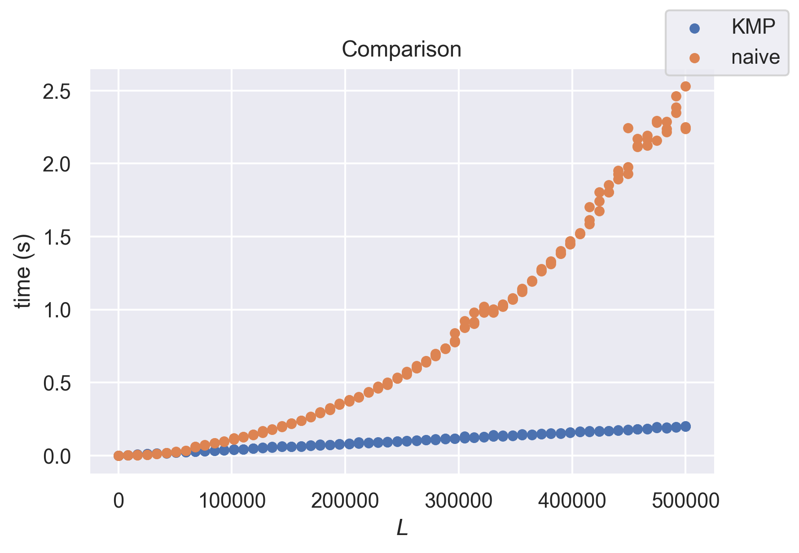
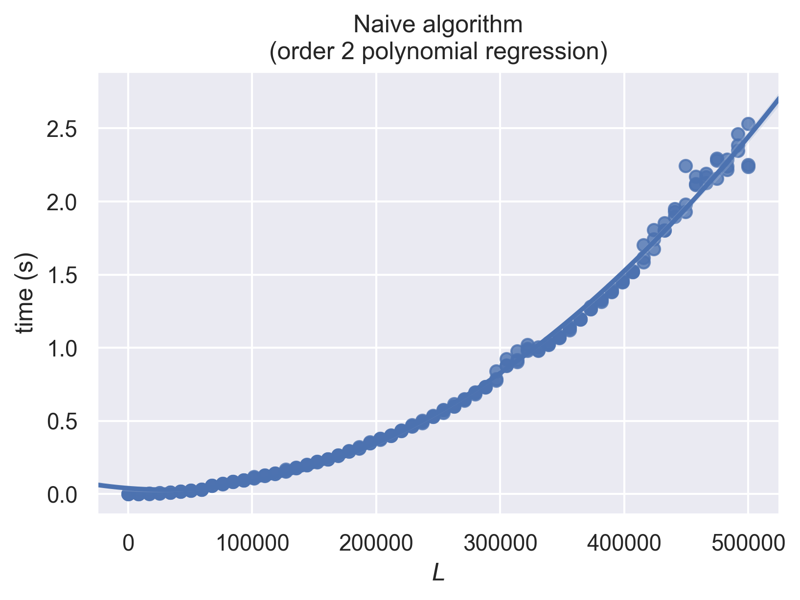
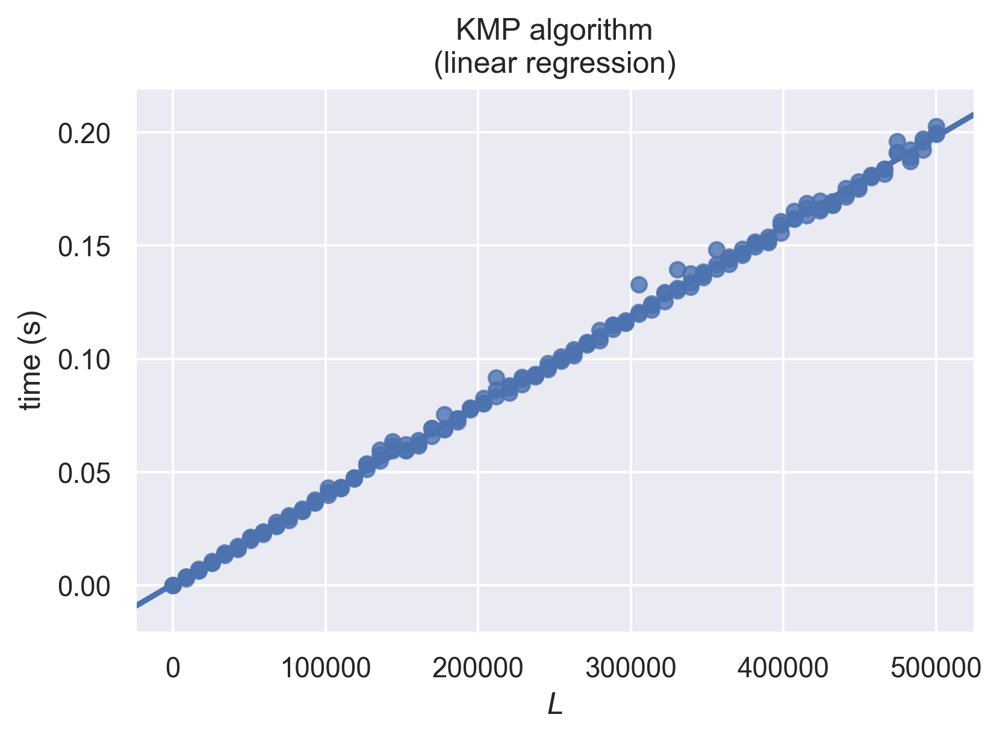
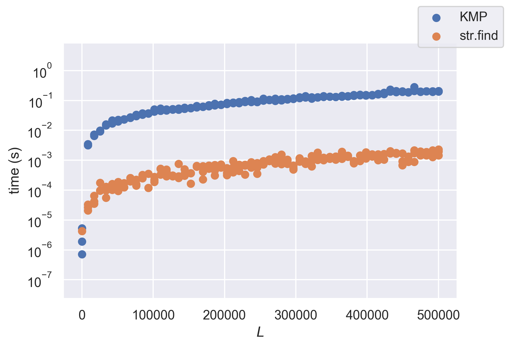

Let's say we want to search for a pattern `p` (a small string, the needle) inside a text `t` (a larger string, the haystack).

## Naive algorithm

A naive algorithm for this task could be:

```python
def naive_search(p, t):
    for i in range(0, len(t) - len(p) + 1):
        if t[i:i + len(p)] == p:
            return i
    return None
```

_Implementation detail:_  
the last check we want to do is `p == t[len(t) - len(p) : len(t)]`, that's why the range's upper bound is `len(t) - len(p) + 1`.

### Complexity

The worst case time complexity of this algorithm is $O(|P|(|T|-|P|)) = O(|P||T|)$ where $|P|$ is the length of the pattern and $|T|$ the length of the text. This isn't practical for large inputs (eg. $P = 10^4$ and $T = 10^8$).

However, this worst case time complexity doesn't happen for all possible inputs.

### Example 1

If we search for `"Morris"` inside any larger text, we can see than most of time time, it takes only one comparison to know that `t[i:i+len(p)]` is different from `p`.

Let's say it took 5 comparisons to know that `t[i:i+len(p)]` is different from `p`, then we know that `t[i:i+4]` is `p[:4]` (or `"Morr"`) and, in particular, we know that `t[i+1]` is different from `M` and thus it will take only one comparison to know that `t[i+1:i+1+len(p)]` is different from `p` (the same holds for `i+1`, `i+2` and `i+3`).

This is because the string we're looking for (`"Morris"`) doesn't have any repeating pattern and doesn't "overlap itself".

### Example 2

Now, let's look at a more pathological example.

If we search for `"aaaab"` inside `"aaaaaaaaaaaaaabaaaa"`, most of the time, it will take 5 comparisons to know that `t[i:i+len(p)]` is different from `p`.  
If `t[i:i+len(p)] == p` returned false after 5 comparisons, we threw away the knowledge than `t[i:i+4]` is equal to `p[:4]`.
If `t[i:i+4]` is equal to `p[:4]` (`"aaaa"`), we know that `t[i+1:i+4]` is equal to `p[1:4]` (`"aaa"`), which is itself equal to `p[:3]`. This knowledge can save us 3 comparisons when we test if `t[i+1:i+1+len(p)]` is equal to `p`.

The same idea holds for strings that have more complicated repeating patterns: for instance if it takes 10 comparisons to know that `t[i:i+10]` is different from `"ababcababd"`, we know that `t[i+5:i+9]` is equal to `p[5:9]` (`"abab"`), which is itself equal to `p[:4]`. This knowledge could save us 4 comparisons when when testing for `t[i+5:i+15] == p`.

This is the main idea behind the [Knuth–Morris–Pratt (or KMP) algorithm](https://en.wikipedia.org/wiki/Knuth%E2%80%93Morris%E2%80%93Pratt_algorithm).

## The Knuth–Morris–Pratt algorithm

Let's assume that we have an function called `kmp_jump_table(p)`, that, for any pattern `p`, returns a `jump` list of length `len(p)+1` with the following properties:

- `jump[0] = -1`
- `jump[i]` is the largest `0 <= j < i` such as `p[:j] == p[i-j:i]` (ie. there exists `s` such as `p[:i] == s + p[:j]`)

For example, for `p = "ababc"`, we would have `jump = [-1, 0, 0, 1, 2, 0]`.

The beautiful property of this `jump` list is: for any `j > 0`, if `p[:j] == t[i-j:i]`, then `p[:jump[j]] == t[i-jump[j]:i]` (`jump[j] >= 0` because `j > 0`).

Here's an implementation of the KMP algorithm:

```python
def kmp_search(p, t):
    jump = kmp_jump_table(p)
    j = 0
    for i in range(len(t)): # loop 1
        while j >= 0 and t[i] != p[j]: # loop 2
            j = jump[j]
        j += 1
        if j == len(p):
            return i + 1 - len(p)
    return None
```

The following invariants are maintained during the execution:

- at the beginning of every iteration of loop 1:

  - `j >= 0`
  - `j` is the greatest number such as `p[:j] == t[i-j:i]`

- at the beginning of every iteration of loop 2:
  - `j` is any number such as `p[:j] == t[i-j:i]`

The magic happens in loop 2.

Because of how `jump` was constructed, `j = jump[j]` keeps the loop 2 invariant true.

Loop 2 exits when either:

- `j < 0` (ie. `j == -1`): we have explored all `j` values such as `p[:j] == t[i-j:i]`, and we didn't find any that verifies `t[i] == p[j]`

- `t[i] == p[j]`: we have found a `j` value such as `p[:j] == t[i-j:i]` and `t[i] == p[j]`, and since we explored the `j` candidate values in a decreasing order (we have `jump[j] < j`), the `j` we found is the greatest

In both cases, `j` is the greatest number such as `p[:j+1] == t[i+1-(j+1):i+1]`, so performing `j += 1` after loop 2 exits makes sure that the loop 1 invariant is true at the beginning of the next iteration.

_Note: the `jump[j] < j` condition also makes sure that loop 2 exits eventually_

After performing `j += 1`, we have `p[:j] == t[i+1-j:i+1]`, we exit if `j == len(p)`, because we have `p[:j] == p` and thus the beginning of `p` in `t` is at index `i + 1 - len(p)`.

## Examples

_`p = "aab"` and `t = "aacaaab"`_

```
- loop 1: i=0 j=0 p=[]aab t=[]aacaaab
  loop 1: p[j] == t[i] (a == a) => extend matched prefix

- loop 1: i=1 j=1 p=[a]ab t=[a]acaaab
  loop 1: p[j] == t[i] (a == a) => extend matched prefix

- loop 1: i=2 j=2 p=[aa]b t=[aa]caaab
    - loop 2: p[j] != t[i] (b != c) => try to extend smaller prefix
      loop 2: j = jump[2] = 1
      loop 2: i=2 j=1 p=[a]ab t=a[a]caaab
    - loop 2: p[j] != t[i] (a != c) => try to extend smaller prefix
      loop 2: j = jump[1] = 0
      loop 2: i=2 j=0 p=[]aab t=aa[]caaab
    - loop 2: p[j] != t[i] (a != c) => try to extend smaller prefix
      loop 2: j = jump[0] = -1
      loop 2: i=2 j=-1
  loop 1: cannot extend any prefix

- loop 1: i=3 j=0 p=[]aab t=aac[]aaab
  loop 1: p[j] == t[i] (a == a) => extend matched prefix

- loop 1: i=4 j=1 p=[a]ab t=aac[a]aab
  loop 1: p[j] == t[i] (a == a) => extend matched prefix

- loop 1: i=5 j=2 p=[aa]b t=aac[aa]ab
    - loop 2: p[j] != t[i] (b != a) => try to extend smaller prefix
      loop 2: j = jump[2] = 1
      loop 2: i=5 j=1 p=[a]ab t=aaca[a]ab
  loop 1: p[j] == t[i] (a == a) => extend matched prefix

- loop 1: i=6 j=2 p=[aa]b t=aaca[aa]b
  loop 1: p[j] == t[i] (b == b) => extend matched prefix
  loop 1: j == len(p) => return 4 = i + 1 - len(p)
```

_`p = "ababc"` and `t = "abababc"`_

Notice what happens on iteration `i = 4`.

```
- loop 1: i=0 j=0 p=[]ababc t=[]abababc
  loop 1: p[j] == t[i] (a == a) => extend matched prefix

- loop 1: i=1 j=1 p=[a]babc t=[a]bababc
  loop 1: p[j] == t[i] (b == b) => extend matched prefix

- loop 1: i=2 j=2 p=[ab]abc t=[ab]ababc
  loop 1: p[j] == t[i] (a == a) => extend matched prefix

- loop 1: i=3 j=3 p=[aba]bc t=[aba]babc
  loop 1: p[j] == t[i] (b == b) => extend matched prefix

- loop 1: i=4 j=4 p=[abab]c t=[abab]abc
    - loop 2: p[j] != t[i] (c != a) => try to extend smaller prefix
      loop 2: j = jump[4] = 2
      loop 2: i=4 j=2 p=[ab]abc t=ab[ab]abc
  loop 1: p[j] == t[i] (a == a) => extend matched prefix

- loop 1: i=5 j=3 p=[aba]bc t=ab[aba]bc
  loop 1: p[j] == t[i] (b == b) => extend matched prefix

- loop 1: i=6 j=4 p=[abab]c t=ab[abab]c
  loop 1: p[j] == t[i] (c == c) => extend matched prefix
  loop 1: j == len(p) => return 2 = i + 1 - len(p)
```

## Building the jump table

Per the previous section, `kmp_jump_table(p)` should be a function that, for any pattern `p`, returns a `jump` list of length `len(p)+1` with the following properties:

- `jump[0] = -1`
- `jump[i]` is the largest `0 <= j < i` such as `p[:j] == p[i-j:i]` (ie, there exists `s` such as `p[:i] == s + p[:j]`)

Here's an implementation of the `kmp_jump_table` function:

```python
def kmp_jump_table(p):
    jump = [-1] + [0] * len(p)
    j = 0
    for i in range(2, len(p) + 1): # loop 1
        while j >= 0 and p[i - 1] != p[j]: # loop 2
            j = jump[j]
        j += 1
        jump[i] = j
    return jump
```

This code looks a lot like the KMP algorithm itself.

The following invariants are maintained during the execution:

- at the beginning of every iteration of loop 1:

  - `0 <= j < i - 1`
  - `j` is the greatest number such as `p[:j] == p[i-1-j:i-1]`
  - the final values for `jump[0],jump[1],...,jump[i-1]` are already computed

- at the beginning of every iteration of loop 2:
  - `j` is any number such as `p[:j] == p[i-1-j:i-1]`

Like in the KMP algorithm, `j = jump[j]` keeps the loop 2 invariant true.

Loop 2 exits when either:

- `j < 0` (ie. `j == -1`): we have explored all `j` values such as `p[:j] == t[i-1-j:i-1]` and we didn't find any that verifies `p[i-1] == p[j]`

- `p[i-1] == p[j]`: we have found a `j` value such as `p[:j] == p[i-1-j:i-1]` and `p[i-1] == p[j]`, and since we explored the `j` candidate values in a decreasing order (because `jump[j] < j`), the `j` we found is the greatest

In both cases, `j` is the greatest number such as `p[:j+1] == p[i-(j+1):i]`, so performing `j += 1` after loop 2 exits makes sure that the loop 1 invariant is true at the beginning of the next iteration.

## Complexity

In the main part of the KMP algorithm:

- loop 1 runs at most `len(t)` times
- loop 2 runs at most `len(t)` times (in total)
  - the value of `j` has a lower bound: `-1`
  - each loop 2 iteration decreases the value of `j`: `j = jump[j]` ( `j < jump[j]`)
  - `j += 1` is run once per loop 1 iteration
  - thus, the total number of loop 2 iterations is smaller than the number of loop 1 iterations

The KMP algorithm itself has complexity $O(|T|)$.

With a similar reasoning, we can see that building the jump table has an $O(|P|)$ time complexity.

**In conclusion, the KMP algorithm has an $O(|P| + |T|)$ time complexity.**

## Benchmarks

### vs. the naive algorithm

Let's now do some benchmarks to check that KMP is faster than the naive algorithm.

In the following benchmarks, an input of size $L$ is composed of a text of length $L$ and a pattern of size $L/2$, both randomly generated and containing 3 different characters (`a`, `b` and `c`).

Because there are only 3 different characters, it's likely that the random patterns will overlap themselves.



We can see that the KMP algorithm is a lot faster than the naive algorithm for large inputs !

Now let's check that the time complexities are what we expect.



We can fit it almost perfectly with an order 2 polynomial, so this seems to confirm that the naive algorithm has an $O(|L|^2)$ time complexity.



And this seems to show that the KMP algorithm has an $O(|L|)$ time complexity.

### vs. `str.find`

Does this mean that this implementation of the KMP algorithm should actually be used ?

There is a method (`str.find`) in the Python standard library that does exactly the same thing, but calls a C function:

```python
def str_find_search(p, t):
    res = t.find(p)
    return res if res != -1 else None
```

It turns out that this code is 100 times faster than the above KMP implementation.



It's not that surprising. In Python, it's almost always better to use a library that calls native code under the hood than rolling your own implementation of an algorithm[^numba].

[^numba]: But if you have to, using [PyPy](https://pypy.org/) or [numba](http://numba.pydata.org/) can make it run a lot faster.
