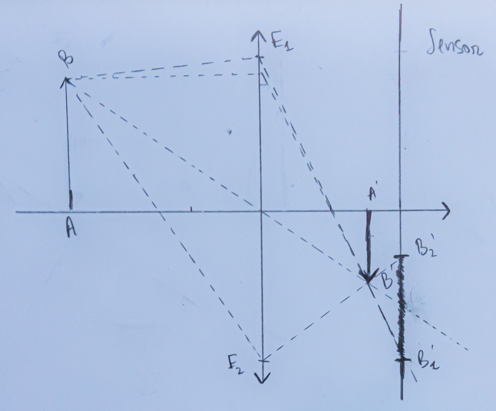

Sur cette photo, la mise au point a été faite sur la _magnifique_ barrière située au premier plan, et, la profondeur de champ étant limitée, les arbres et immeubles situés à l'arrière-plan sont flous. Cet effet de flou s'appelle le _bokeh_.

D'après plusieurs tutos que j'ai pu lire/regarder sur internet, on peut contrôler l'intensité de cet effet à la prise de vue, en jouant sur certains paramètres:

> Pour avoir un joli bokeh, il faut ouvrir son diaphragme, utiliser une longue focale et s'approcher de son sujet. C'est plus facile d'obtenir cet effet avec un appareil ayant un grand capteur qu'avec un compact.

L'opposée de cette citation est aussi vraie. Pour limiter le bokeh et avoir une profondeur de champ plus grande, on peut fermer son diaphragme, s'éloigner de son sujet, utiliser une longueur focale plus courte et un appareil ayant un capteur plus petit.

C'est pour cela qu'une GoPro ou un smartphone, des appareils ayant de tout petits capteurs et des optiques ayant une très courte focale, produisent des images dans lesquelles tout (ou presque) est net[^smartphone].

[^smartphone]: Les smartphones ayant un mode "portrait", qui rend l'arrière plan flou, ont recours à d'autres moyens pour créer cet effet.

## Modélisation

Cette citation m'a fait me rappeler d'un exercice d'optique géométrique que j'avais résolu au début de mes études supérieures, et qui propose un raisonnement permettant de relier la profondeur de champ à certains paramètres de la prise de vue.

Je n'ai pas vraiment cherché à retrouver l'énoncé original, mais je vais m'inspirer de la mémoire que j'ai de l'exercice pour essayer d'expliquer la citation précédente.

Nous allons modéliser notre appareil photo par:

- une lentille mince convergente de focale $f' = \overline{OF'}$
- un diaphragme de rayon $r$
- un capteur qui est simplement une plaque

Faire le point sur un objet $AB$, c'est placer notre objectif (ici, notre lentille) au bon endroit entre cet objet et le capteur de notre appareil, de telle sorte que son image $A'B'$ se forme sur le plan du capteur.

(ici, les points $E_1$ et $E_2$ sont les limites du diaphragme, on a d'ailleurs tracé les rayons "extrêmes")

Si la mise au point n'est pas faite sur l'objet $AB$, les rayons lumineux provenenant du point $B$ formeront une tache (et non un point) sur le capteur:

Considérons maintenant la situation suivante:

La mise au point a été faite sur l'objet $AB$, et on va s'intéresser à un autre objet présent dans le champ, qui est l'objet $CD$.

Le point $D$  a produit sur le capteur une tache $D_1^*D_2^*$ dont nous allons chercher à estimer la taille, plus la taille $\overline{\Delta} = \overline{D_1^*D_2^*}$ de cette tache est grande, plus le point $D$ est flou (et donc plus l'effet de bokeh est présent).

Après un calcul dont le détail est fourni en dessous, on obtient:

$$
\overline{\Delta} = - 2 \overline{OE_1} (f'\frac{\overline{AC}}{\overline{OA}(\overline{OA} + \overline{AC})} + f'^2\frac{1}{\overline{OA}(\overline{OA} + \overline{AC})})
$$

_NB_: cette formule n'est valable que si $\frac{f'}{\overline{OA}} \ll 1$, donc uniquement si l'objet sur lequel on fait le point est "loin" de l'appareil.

En posant:

- $\alpha = \frac{2\overline{OE_1}}{f'}$, ouverture de l'objectif, telle qu'affichée par un appareil photo, soit le rapport du diamètre de la lentille frontale et de la longueur focale

- $\overline{\delta} = \overline{AC}$, distance entre le plan de l'objet $AB$, sur lequel la mise au point est faite, et le plan de l'objet $CD$, dont on veut estimer le flou

- $\overline{d} = \overline{OA}$, distance de mise au point

La formule peut être ré-écrite:

$$
\overline{\Delta} = -  \alpha (f'^2\frac{\overline{\delta}}{\overline{d}(\overline{d} + \overline{\delta})} + f'^3\frac{1}{\overline{d}(\overline{d} + \overline{\delta})})
$$

(dans l'exemple du schéma, cette formule donne un $\overline{\Delta}$ négatif, ce qui est cohérent car la tache $D_1^*D_2^*$ est dirigé vers le bas)

## Interprétation

### Profondeur de champ

Traçons $|\overline{\Delta}|$ (flou) en fonction de $\overline{\delta}$ (distance par rapport à l'objet sur lequel on a fait le point):

On voit que plus $\overline{\delta}$ est grand (en valeur absolue), donc plus l'objet $CD$ est éloigné de l'objet sur lequel on a fait la mise au point, plus il est flou (on observe d'ailleurs que l'objet est net si $\overline{\delta} = 0$, donc si $CD$ est sur le même plan que $AB$).

On observe aussi que le niveau de flou des objets situés à l'arrière plan (vers $-\infty$ ) converge assez rapidement (vers $-  \alpha f'^2 / \overline{d}$). C'est pour cela que sur la première photo, les arbres situés à quelques dizaines de mètres ont un niveau de flou similaire à celui des tours, qui sont elles à environ $2$ km.

Dans la pratique, un capteur d'appareil photo n'est pas parfait. Il existe donc une valuer de flou limite $\Delta_{\text{lim}}$ telle que si $|\overline{\Delta}| < \Delta_{\text{lim}}$, alors l'objet est perçu comme net par le capteur.

On peut donc visualiser la profondeur de champ sur le graphe précédent (la limite $\Delta_{\text{lim}}$ choisie est arbitraire):

(distance de mise au point: $-2\text{m}$, focale: $50\text{mm}$, ouverture: $\text{f}/2.8$)

Sur ce graphe, les objets situés entre les 2 lignes noires ont un niveau de flou inférieur à $\Delta_{\text{lim}}$ et sont donc nets.

La distance entre ces 2 lignes est donc la profondeur de champ.

### Effet du diaphragme

Plus $\alpha$ est grand, donc plus notre diaphragme est ouvert, plus le bokeh est présent et plus la profondeur de champ est petite:

(distance de mise au point: $-2\text{m}$, focale: $50\text{mm}$)

C'est un résultat que l'on peut voir sur le schéma: plus notre diaphragme est fermé, plus les rayons extrêmes sont "proches" et moins la tache $B_1'B_2'$ est grande.

### Effet de la distance au sujet

Plus $|\overline{d}|$ est petit, donc plus on est proche de son sujet, plus le bokeh est présent:

(focale: $50\text{mm}$, ouverture: $\text{f}/1.8$)

On remarque aussi que plus le sujet sur lequel on fait la mise au point est éloigné, moins le niveau de flou est élevé à l'infini.

Si l'entièreté de la courbe de flou reste sous la limite de netteté du capteur $\Delta_{\text{lim}}$, alors l'entiereté de l'arrière-plan sera net.

La plus courte distance de mise au point pour laquelle cet effet se produit est la distance hyperfocale.

Sur cet exemple fictif (la limite $\Delta_{\text{lim}}$ ayant été choisie au hasard), on voit que la distance hyperfocale est de l'ordre de $10$m.

### Effet de la longueur focale

Plus $f'$ est grand, donc on utilise une longue focale, plus le bokeh est présent:

(distance de mise au point: $-5\text{m}$, ouverture: $\text{f}/4$)

### Compétition entre la longueur focale et la distance au sujet

Si l'objet $AB$ est loin ($f' \ll d$
), le grossissement vaut:

$$
\gamma = \frac{\overline{A'B'}}{\overline{AB}} = \frac{1}{1 + \frac{\overline{d}}{f'}} \approx \frac{f'}{\overline{d}}
$$

Ainsi si on double notre focale et notre distance par rapport à notre sujet, le grossissment reste identique et l'image du sujet sur le capteur \~aussi[^bokeh].

[^bokeh]: C'est faux pour l'arrière plan, car changer de focale va changer l'angle de vue, et donc, avec une focale plus longue, le cadrage de l'arrière plan sera plus serré.

Autrement dit, il existe une infinités de combinaisons longueur focale / distance au sujet qui peuvent nous donner le grossissement voulu pour notre sujet.

Mais toutes ces combinaisons sont-elles équivalentes du point de vu du flou d'arrière plan ?

D'après un inconnu sur internet, elles ne le sont pas:

> Une bonne manière pour avoir plus de bokeh avec un zoom, c'est de zoomer le plus possible, et de si besoin s'éloigner du sujet pour garder le grossissement voulu.

Pour expliquer pourquoi, reprenons la formule du flou limite (en l'infini):

$$
|\overline{\Delta}_{\text{max}}| = \lim\limits_{\overline{d} \rightarrow - \infty} |\overline{\Delta}| = -  \alpha f'^2 / \overline{d}
$$

(cette valeur est positive car $\overline{d}$ est négatif)

On remarque que ce flou est influencé par la distance de mise au point avec un facteur $\frac{1}{\overline{d}}$ et par la longueur focale avec un facteur $f'^2$.

Ainsi, si on double notre focale et la distance par rapport à notre sujet, le grossissement restera le même, mais l'intensité du flou d'arrière plan (à l'infini) sera multipliée par 2.

(ouverture: $\text{f}/4$)

### Effet de la taille du capteur

Regardons maintenant la fin de la citation, qui prétend qu'un appareil photo ayant un plus grand capteur produit plus de bokeh.

Imaginons que l'on souhaite que l'image de l'objet $AB$ prenne 50% de la hauteur de notre photo. La taille de l'image $A'B'$ de cet objet devra donc faire 50% de la hauteur de notre capteur, et ainsi, plus notre capteur est grand, plus il faudra produire une grande image $A'B'$.

Lorsque $AB$ est loin, le grossissement vaut:

$$
\gamma \approx \frac{f'}{\overline{d}}
$$

Ainsi, si on double la taille de notre capteur, il faudra environ doubler notre focale pour obtenir la même photo. On a pu voir précédemment que la longueur focale a elle une grande influence sur le niveau de flou à l'infini ($|\overline{\Delta}_{\text{max}}| =- \alpha f'^2 / \overline{d}$
).

Avoir un plus grand capteur donc aide à obtenir du bokeh, car cela permet d'utiliser des focales plus longues.

On pourrait dire que si on augmente la taille du capteur tout en gardant le même nombre de pixels, on va aussi augmenter la limite de netteté $\Delta_{\text{lim}}$ définie plus haut (car chaque pixel individuel devient plus gros), et que cela risque de compenser l'effet qu'on vient de décrire.

Je pense qu'on peut faire l'hypothèse que $\Delta_{\text{lim}}$ augmente linéairement avec la taille d'un pixel sur le capteur. Le niveau de flou à l'infini $|\overline{\Delta}_{\text{max}}| =-  \alpha f'^2 / \overline{d}$ est lui en $f'^2$. Ainsi, si on double la hauteur de notre capteur, on multiplie $\Delta_{\text{lim}}$ par $2$ et $|\overline{\Delta}_{\text{max}}|$ par  $4$.
En faisant l'hypothèse que le niveau de flou en l'infini perçu par notre oeil est proportionnel à $\frac{|\overline{\Delta}_{\text{max}}|}{\Delta_{\text{lim}}}$, doubler la taille de notre capteur revient donc à doubler le niveau de flou perçu par notre oeil.

## Conclusion

En supposant qu'il n'y a pas de grosse erreur dans les raisonnements, cette citation semble vraie.

__Détails du calcul__

Sur ce dessin nous avons:

- l'objet $AB$ et son image $A'B'$, sur lequel la mise au point est faite, $A'B$ est dont sur le capteur de l'appareil photo
- l'objet $CD$  et son image $C'D'$, dont on cherche à estimer le flou.

Pour estimer le flou de $C'D'$, on va calculer la taille de la tache $D_1^*D_2^*$ formée sur le capteur par les rayons créant l'image $D'$ de $D$.

On introduit le point $D^*$, intersection entre le capteur et le rayon $DOD'$.

Commençons par montrer que $D^*$ est au centre de la tache, ie, que $\overline{D_1^*D^*}$ = $\overline{D^*D_2^*}$.

Le théorème de Thalès donne:

$$
\frac{\overline{D^*D_2^*}}{\overline{OE_2}} = \frac{\overline{D^*D'}}{\overline{OD'}}
$$

$$
\frac{\overline{D_1^*D^*}}{\overline{E_1O}} = \frac{\overline{D^*D'}}{\overline{OD'}}
$$

Notre diaphragme étant symmétrique, on a donc $\overline{E_1O} = \overline{OE_2}$ et on obtient ainsi $\overline{D_1^*D^*} = \overline{D^*D_2^*}$.

On peut donc se limiter à calculer $\overline{D_1^*D^*} = \overline{D_1^*D_2^*} / 2$.

On introduit le point $H$ intersection entre l'axe optique et le rayon $E_1D'$.

Le théorème de Thalès donne les équations suivantes:

$$
\overline{A'D_1'} = \frac{\overline{HA'}\overline{OE_1}}{\overline{HO}} = \frac{(\overline{HO} + \overline{OA'})\overline{OE_1}}{\overline{HO}} = \overline{OE_1}(1 + \frac{\overline{OA'}}{\overline{HO}})
$$

$$
\frac{HO}{\overline{HC'}} = \frac{OE_1}{\overline{C'D'}} \Leftrightarrow \frac{1}{\overline{HO}} = \frac{\overline{C'D'} - \overline{OE_1}}{\overline{OC'}\overline{OE_1}}
$$

En injectant la seconde équation dans la première, on obtient:

$$
\overline{A'D_1'} = \overline{OE_1} - \overline{OE_1} \frac{\overline{OA'}}{\overline{OC'}} + \overline{OA'} \frac{\overline{CD}}{\overline{OC}}
$$

Le théorème de Thalès donne:

$$
\overline{A'D^*} = \frac{\overline{OA'}\overline{CD}}{\overline{OC}}
$$

En sommant les 2 dernières équations, on obtient:

$$
\overline{\Delta} = 2\overline{D_1^*D^*} = 2\overline{OE_1}(\frac{\overline{OA'}}{\overline{OC'}} - 1)
$$

En combinant les relations de conjugaison $\frac{1}{\overline{OA'}} - \frac{1}{\overline{OA}} = \frac{1}{\overline{f'}}$ et $\frac{1}{\overline{OC'}} - \frac{1}{\overline{OC}} = \frac{1}{\overline{f'}}$, on obtient:

$$
\frac{\overline{OA'}}{OC'} = \frac{1 + f'/\overline{OC}}{1 + f'/\overline{OA}}
$$

On a donc, au premier ordre lorsque  $\frac{f'}{\overline{OA}}  \ll 1$:

$$
\frac{\overline{OA'}}{OC'} = (1 + f'/\overline{OC})(1 - f'/\overline{OA})
$$

$$
\frac{\overline{OA'}}{OC'} = 1 - f'\frac{\overline{AC}}{\overline{OA}(\overline{OA} + \overline{AC})} - f'^2\frac{1}{\overline{OA}(\overline{OA} + \overline{AC})}
$$

En injectant cette équation dans la formule de $\Delta$ écrite plus haut, on obtient la formule citée plus haut:

$$
\overline{\Delta} = - 2 \overline{OE_1} (f'\frac{\overline{AC}}{\overline{OA}(\overline{OA} + \overline{AC})} + f'^2\frac{1}{\overline{OA}(\overline{OA} + \overline{AC})})
$$

_Note_: ce calcul est inutilement complexe, la taille de la tache n'est pas fonction de la distance du point $D$ par rapport à l'axe optique, on aurait donc pu choisir un point $D$ situé sur l'axe optique, ce qui aurait rendu la figure, les raisonemments géométriques et les calculs plus simples. Notamment, il n'aurait pas été nécessaire d'introduire le point H.
